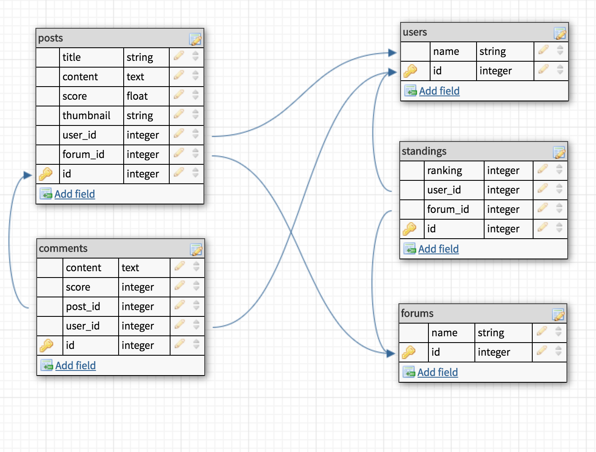

# Test application for Egalitarian gem

### Description
The purpose of this application is to simulate a forum environment to test, demonstrate, and help develop what the Egalitarian gem will do.

following along with the <a href="http://guides.rubygems.org/make-your-own-gem/#adding-an-executable">adding an executable</a> lesson at rubygems.org.

### Forum schema map

egalitarian bundling success

