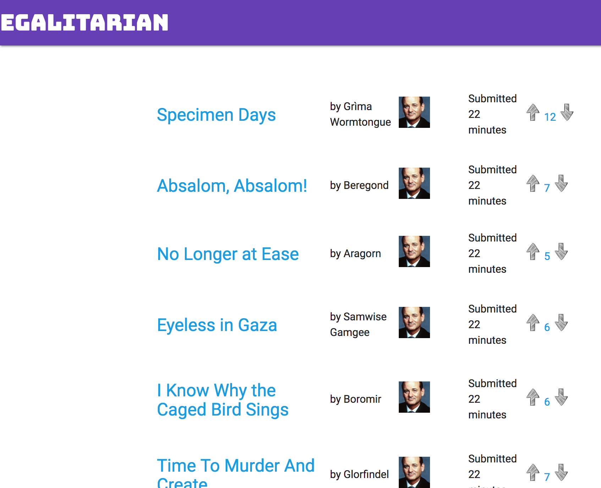
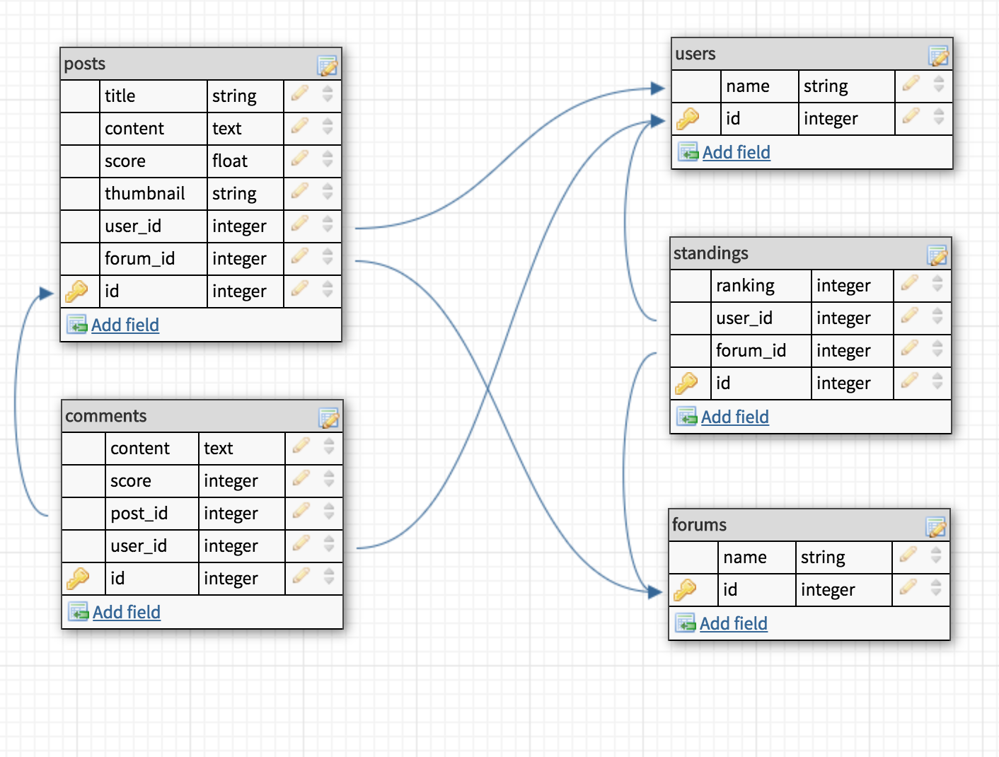

# Test application for Egalitarian gem

### Description
The purpose of this application is to simulate a forum environment to test, demonstrate, and help develop the Egalitarian gem.

This application will seed users, posts, comments, and votes for posts. You can navigate to a user page to see which posts they have made. the goal of Egalitarian is to add a rating to the user page and apply it to the acts_as_votable gem's votes for weight adjustment. Forums have been left out for the moment to simplify the development process.

following along with the <a href="http://guides.rubygems.org/make-your-own-gem/#adding-an-executable">adding an executable</a> lesson at rubygems.org.

### Forum schema map

egalitarian bundling success

